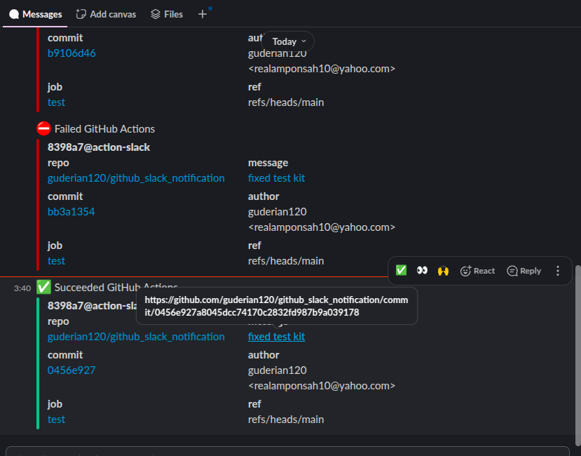

# GitHub Actions CI with Slack Notifications

This repository demonstrates a basic CI workflow using GitHub Actions to automatically run tests on every push to the `main` branch and send a notification to Slack via an incoming webhook.


### Slack notification

 


## Features

- GitHub Actions workflow triggered on push to `main`
- Runs tests using `pytest`
- Sends a Slack notification on success or failure

## Requirements

- Python 3.10+
- `pytest`
- Slack Incoming Webhook URL

## Setup

### 1. Clone the Repository

```bash
git clone https://github.com/guderian120/github_slack_notification
cd github_slack_notification
````

### 2. Install Dependencies

```bash
pip install pytest
```

### 3. Add Slack Webhook to GitHub Secrets

Go to your repository settings:

* Navigate to **Settings > Secrets and variables > Actions**
* Add a new secret:

  * **Name**: `SLACK_WEBHOOK_URL`
  * **Value**: Your Slack webhook URL

### 4. Configure GitHub Actions Workflow

The workflow file is located at:

```
.github/workflows/test-and-notify.yml
```

This workflow:

* Installs dependencies
* Runs tests using `pytest`
* Sends a Slack notification on job completion

## Usage

Push any changes to the `main` branch. The workflow will run automatically. You can view results in:

* The **Actions** tab on GitHub
* The configured Slack channel

## License

This project is licensed under the MIT License.

```

---

